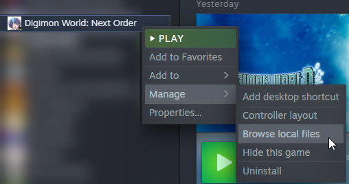
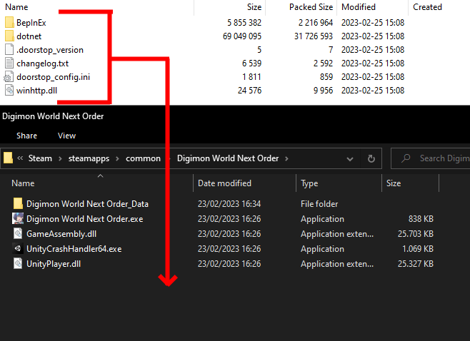
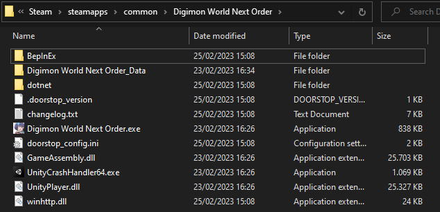
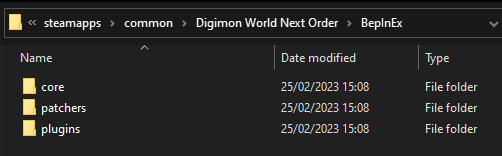
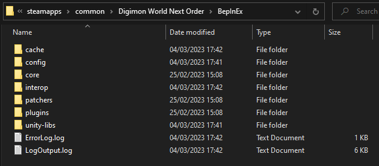
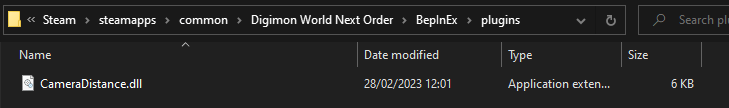
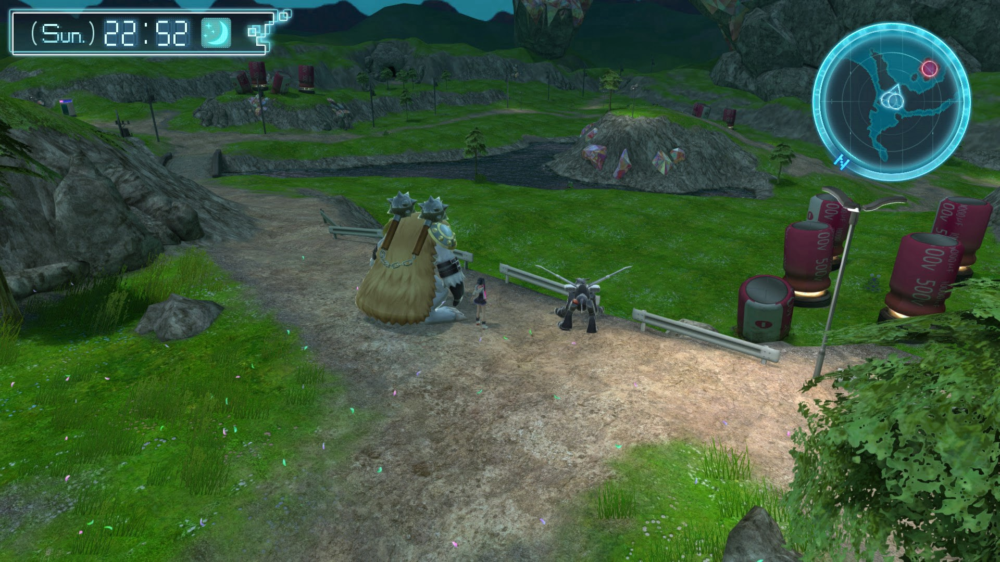

# How to install BepInEx for Digimon World: Next Order

## Step 1

Get the latest version of BepInEx Bleeding Edge here : [BepInEx Bleeding Edge](https://builds.bepinex.dev/projects/bepinex_be)

Simply click on the first button below "Artifacts", it will drop a list of all downloads link for different OS.

DWNO is made using Unity IL2CPP, so you'll click on one that precise those.

For Windows, you would click on that button :

*Tag at the end (6.0.0-be.667+6b500b3) might be different for you, as that indicate the version.*

## Step 2

Once you've downloaded BepInEx, you'll need to go in your DWNO directory.
You can access it quickly using steam, right click the game's => Manage => Browse local files.

Now that you are in DWNO's directory, open the .zip you downloaded, and simply drop the contents inside DWNO's directory.

After moving the files, your directory should now looks like this :

## Step 3

This step is pretty simple, just run the game once. Yep, that's all. Game will take a bit more time to launch so BepInEx get setup properly. After the game has launched, you can just close it.

If everything went fine, the BepInEx folder contents will change from this :

To this :

## Step 4 (Finale)

Now that BepInEx is properly installed, you can finally add some mods !

You can find mods for DWNO on those sites :

- [NexusMods](https://www.nexusmods.com/digimonworldnextorder)

Be mindful that some mods can have different installation process (BepInEx DLLs, changing a .cpk file, using CriBindDir, etc), the mod uploader generally indicate how to install them. But we'll focus on the BepInEx DLLs here.

Pick whatever mods you want, but for this guide i'll pick this one : [Camera Distance](https://www.nexusmods.com/digimonworldnextorder/mods/2)

After downloading the mod, put the .dll in BepInEx/plugins, it should then looks like this :

Now, simply run the game.

Go into an open area, and press the zoom button, you should be able to zoom way past the limit.

*Nice, i can finally see past those huge mons aside me!*

And that's it, enjoy modding !